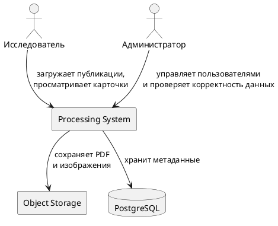
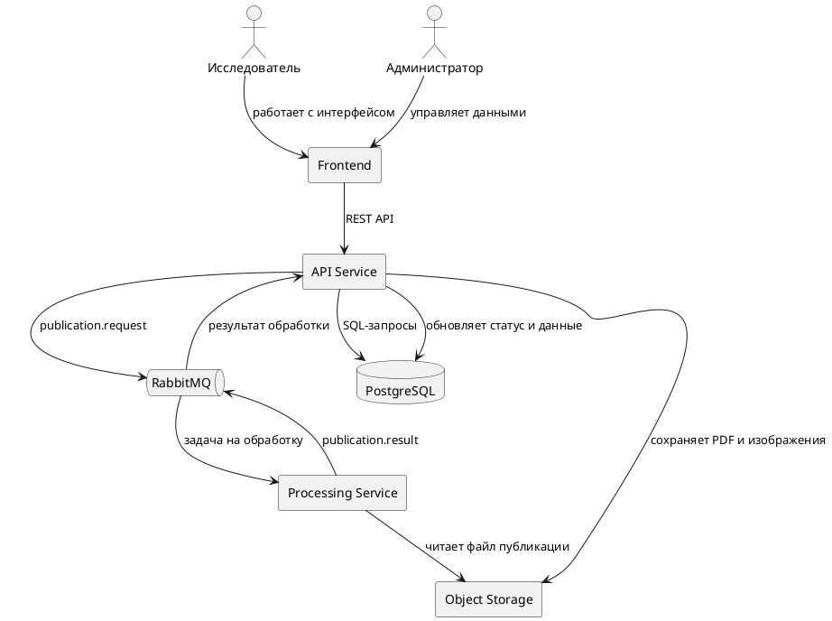

# Архитектура

## C1 — Контекстная диаграмма

Диаграмма показывает систему обработки публикаций с участием внешних участников и сервисов 

## C2 — Контейнерная диаграмма
Диаграмма показывает внутреннее взаимодействий компонентов системы, демонстрирует связи между ними

## Основные компоненты

| Компонент | Назначение |
|---|---|
| Frontend | Интерфейс для загрузки публикаций, просмотра архива, поиска и взаимодействия с карточками катализаторов |
| API Service | Основной backend, который принимает REST-запросы, работает с БД и отправляет задачи на обработку |
| Processing Service | Сервис обработки публикаций и извлечения данных о катализаторах|
| RabbitMQ | Брокер сообщений для асинхронной передачи задач и результатов обработки |
| PostgreSQL | Реляционная БД для хранения метаданных|
| Object Storage | Хранилище PDF публикаций и изображений структур катализаторов |

## Внешние зависимости

| Сервис | Тип интеграции | Описание |
|---|---|---|
| Object Storage | HTTP / SDK | Хранение PDF публикаций и изображений структур|
| RabbitMQ | AMQP | Асинхронная передача задач обработки и результатов |
| PostgreSQL | SQL | Хранение публикаций, катализаторов, синтезов, пользователей |
