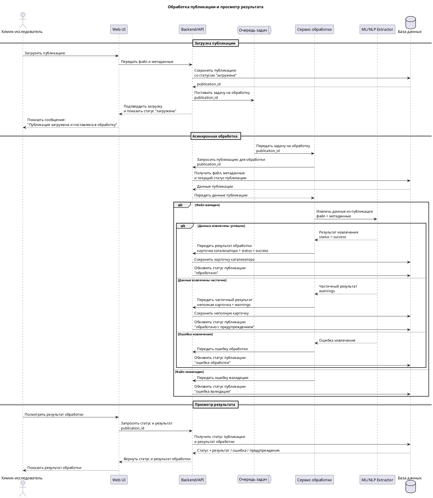
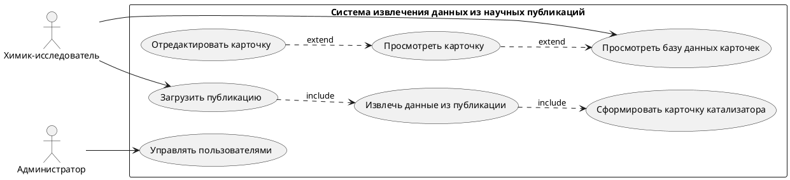

В данном разделе представлены UML-диаграммы, описывающие поведение системы и взаимодействие её компонентов

---

## Диаграмма последовательностей

Диаграмма последовательностей описывает процесс загрузки публикации, её асинхронной обработки и получения результата пользователем

### Описание

Основные этапы:

- Пользователь загружает публикацию через Web UI
- Backend сохраняет публикацию и ставит задачу в очередь
- Сервис обработки извлекает данные (ML/NLP extractor)
- Формируется карточка катализатора
- Результат сохраняется в базе данных
- Пользователь может запросить статус и результат обработки

### Особенности

- Асинхронная обработка через очередь задач
- Возможность частичного результата
- Обработка ошибок

---

## Диаграмма вариантов использования

Диаграмма вариантов использования описывает основные сценарии взаимодействия пользователей с системой

### Акторы

- **Химик-исследователь**
- **Администратор**

### Основные сценарии

Для химика:

- Загрузка публикации
- Просмотр карточки катализатора
- Редактирование карточки
- Просмотр базы данных

Для администратора:

- Управление пользователями

### Внутренние процессы системы

- Извлечение данных из публикации
- Формирование карточки катализатора

---
